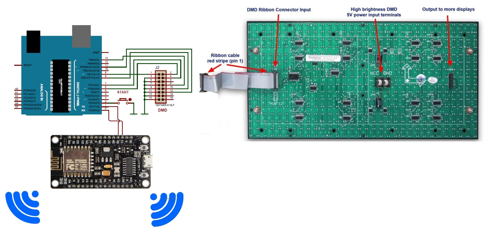
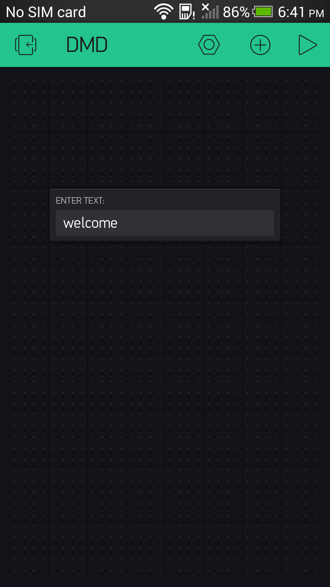
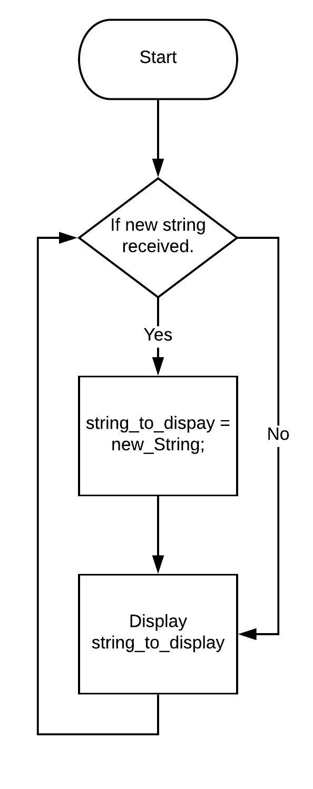

# DMD-IoT-Board

## Abstract:
There are tons of advertisement and handouts given every day. Making it one of the most used paper related work. To reduce the paper work digital display boards were introduced. The problem with them was that they were completely static. The string that they were programmed to display was completely hard coded in the source code. To make them display a different string/text they were required to reprogrammed with new text string. This was a job for a technical/trained person. A simple shop owner or non-technical person cannot reprogram a DMD to display a different text. The core concept of this project is to make that displaying system more feasible for non-technical users. In today’s era even, a non-technical user knows how to use a mobile phone. They just need to type a string on their mobile phone and that string will be displayed on the display.
 
## Introduction: 
These type of display boards or simply put, notice boards can be seen almost everywhere. They might vary in shapes or sizes but the main concept behind these boards are the same that they are used to display messages or notify people about what's happening or what's the status of concerning entity.
Problem Statement:
Most of the boards that you see in the market are probably hard coded with a particular text. Meaning a message is entered as a static string inside the code and the only purpose of that board is to just scroll that again and again but what if you want to change it in that case you need to unplug that bored and change the source code. Now the problem with that is it's a complete waste of time or energy if someone wants to update that daily. Even some people don't know how to do that you need a specific person or someone with a special skill set. Or even with the help of a person that know how to do that you require that source code in which you want to do changes.  Misplacing that source code will result in more waste of time. With the current constant strings scrolling approach you can just display the name of the shop or something that you think will not change soon. You cannot display prices as they might change the next day, so this makes this project or innovation a bit limited. 
## Solution:
Now what if we can take this concept and make this user friendly for the people who are not so technical or who cannot just unplug a display change the string of text in the source code. Doing that will attract more people. Now the main idea behind this project is to make this older approach a bit attractive or usable to normal people. normal people cannot just unplug a board and change the source code according to their choice. They won't even understand that for them a more interesting or usable thing would be like sending a text through Wi-Fi and displaying it on the board, they will even enjoy that.
## Approach:
Make it feasible for normal market We can just simply upgrade the older version of that approach by making it capable of receiving a text via Internet and displaying the new received text on the dot matrix display. 
Now the question arises why should the market accept it? How it can be altruistic for the people? It has more than one benefit 
1. Saving of resources like you don't have to print out new pamphlets or handouts for every new material that came in the market.
2. People tend to read the flashing signs rather than walking around and reading what's written on the poster or the paper pasted on the wall. It's like the more the thing is flashy the more the people will read that.
3. Last but not least is that it will save a lot of paper.
## Related Work:
A lot of work done on these dot matrix displays from making them compatible with smaller to smaller Arduino boards to making them bigger, easier to use and power efficient. But I don’t seem to recall any reference during my study that uses IoT approach on this. 
## Proposed design:
This proposed design consists of following:
1.	NodeMCU
2.	Arduino UNO
3.	DMD P10
4.	LDC 16 Pin Cable
Node MCU is used for receiving data/string wirelessly. DMD is for displaying text. Dmd is itself interfaced with the arduino. The Node MCU receives the text and sends it serially to the arduino and arduino then displays the received text on DMD.

## Interface:
With this interface which you can simply send a text string to the node mcu to display on the dmd. You just need to enter a string (100 characters)  in the text box displayed below, hit enter and this text will be received by ESP8266 and it will then transmit it serially to arduino. Arduino will then display it on the dmd.
 

## Flowchart:
Whenever one rotation of the text is completed the Arduino checks if it has received a new string to be displayed. If new string is received via ESP8266, it displays new string. If not, it again sets older string to display.

## Analysis:
The above explained model of this project works perfectly fine. The only constraint of this project is that it needs a constantly working internet connection, but this is the only way you can control this via internet. If you want to change that to as a Wi-Fi server, you can only access it by connecting to same server. This more limits the user to be at the same network. This way the versatility of this project shrinks. The future work might contain accessing multiple display boards via a single interface or app. 

## References:
https://www.instructables.com/id/Display-Text-at-P10-LED-Display-Using-Arduino/

https://www.instructables.com/id/How-to-Use-an-P10-Module-With-Arduino/

http://forum.freetronics.com/viewtopic.php?t=6396
